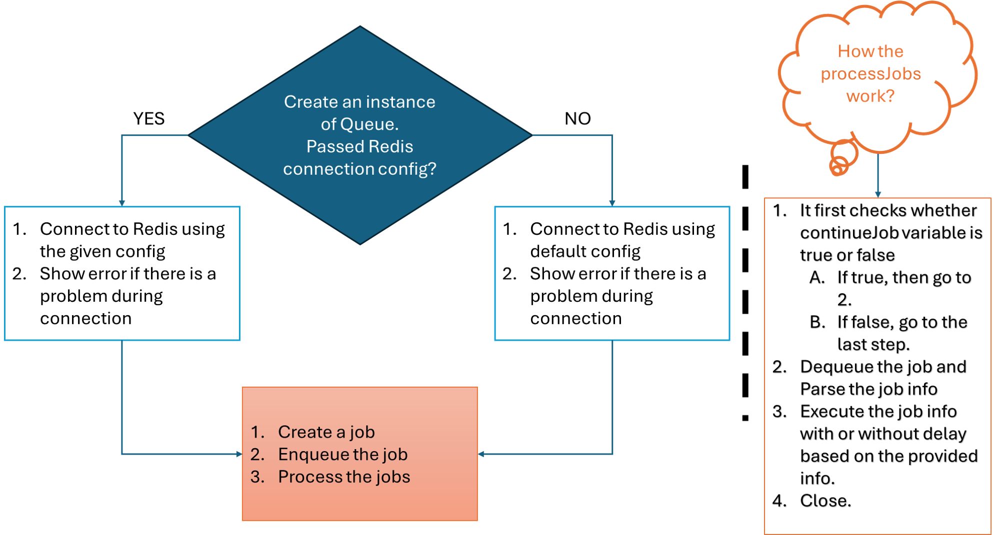

# Express and Custom Queue Example (Without Any Library except for redis)

In this repository, I have created a queue system without using any library like Bull. I have used redis for building the queue system.
I have also added some example scenarios on how to use the created system. I have added three examples:

1. Simple job execution
2. How to send notification
3. How retry mechanism works

## Prerequisites

- Node.js and npm installed
- Redis server running locally or at a specified host and port

## Workflow

## How to use the Queue system:

1. Create an instance of Queue. You can pass connection configuration of redis during creating of an instance. But this is optional, if you don't provide the connection config then make sure that the redis instance is connected to the host "127.0.0.1" and port 6379.
2. After creating the instance make your jobs. Use Job class to make job instances.
3. Enqueue the jobs into the queue.
4. Finally, process the jobs. You have to pass a function that should be executed to do your specific tasks. Such as, sending mail, notifications etc.
5. During Enqueue a job, you can pass optional params. Currently only delay and retry params are available.
