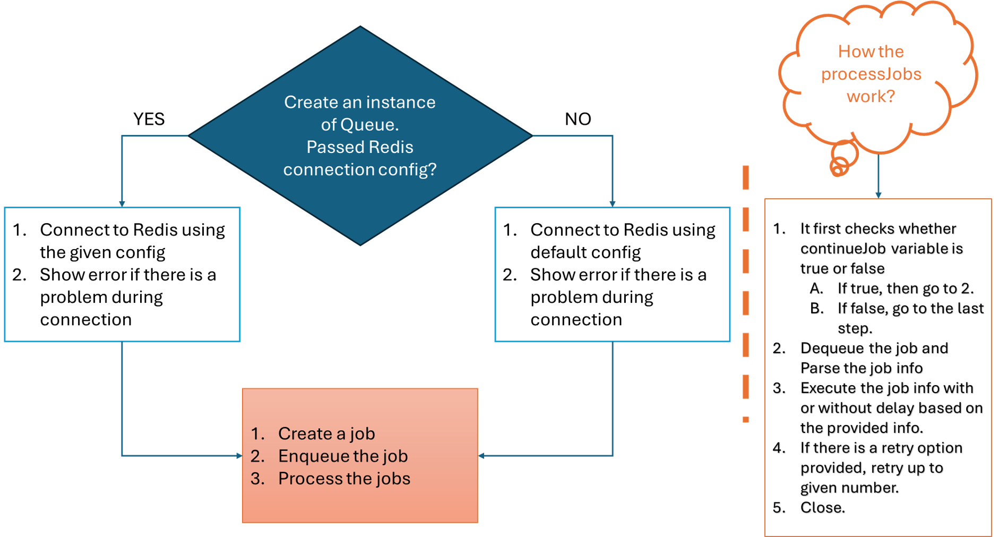

# Express and Custom Queue Example (Without Any Library except for redis)

This is a simple example of an Express API without using any library for queue-based job processing.

## Prerequisites

- Node.js and npm installed
- Redis server running locally or at a specified host and port

## Workflow

